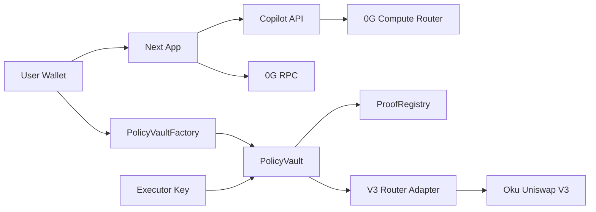

# 4lpha 0G Policy Vault Threat Model

Date: 2026-06-20

## Executive Summary

The main risk theme is loss of user-deposited native 0G through misconfigured vault creation, compromised executor/proof authority, unsafe DEX adapter selection, or incorrect slippage units. Current code mitigates the highest-risk vault paths: per-wallet vault creation is owner-bound, mainnet mock adapters are blocked, the real adapter is fixed to Oku/Uniswap V3 `SwapRouter02`, pool IDs bind to factory-registered pools, slippage bps is checked against `quotedAmountOut`, and a real 0G funding smoke passed. No critical unresolved vault issue is known in the current verified scope.

## Scope And Assumptions

In scope:
- `contracts/PolicyVault.sol`, `contracts/PolicyVaultFactory.sol`, `contracts/ProofRegistry.sol`, `contracts/UniswapV3SwapRouter02Adapter.sol`.
- Vault UI and wallet flows under `components/app`, `components/surfaces/VaultSurface.tsx`, and `lib/contracts/policy-vault.ts`.
- Mainnet readiness/deploy/smoke scripts under `scripts/`.

Out of scope:
- Full production trading strategy quality and market risk.
- Formal external audit of Oku, USDC.e bridge, or the selected pool.
- Public launch infrastructure, CDN/WAF, and durable rate limiting.

Assumptions:
- Users create their own vault from their connected wallet.
- Factory, proof registry, adapter, token, pool ID, and from-block are public config, not secrets.
- Executor and proof registry operator keys may be compromised, so the vault must enforce policy on-chain.
- Selected mainnet trading pair is USDC.e/W0G on Oku/Uniswap V3 unless the user later changes product scope.

Open questions that change risk ranking:
- Will ProofRegistry ownership move to multisig/timelock before public users deposit meaningful funds?
- What deposit size should mainnet default caps support?
- Will this stay a hackathon demo or become open to unknown users?

## System Model

### Primary Components

- Browser wallet: signs owner-bound vault creation, deposit, withdraw, pause, and revoke.
- Next.js app: renders vault status and server-only Copilot route.
- PolicyVaultFactory: maps each owner to one vault.
- PolicyVault: stores native 0G, enforces owner/admin controls and narrow executor buy/sell flows.
- ProofRegistry: accepts app-level audit/proof metadata used by vault actions.
- UniswapV3SwapRouter02Adapter: immutable adapter for native 0G/W0G <-> allowed token swaps.
- 0G RPC, ChainScan, Storage indexer, Compute Router, Oku/Uniswap V3 contracts: external services/contracts.

### Data Flows And Trust Boundaries

- User wallet -> 0G chain: signed EVM transactions for vault creation and owner controls; enforced by wallet signature and contract `onlyOwner`.
- Browser app -> public RPC: read-only wallet/vault/factory state; untrusted RPC data is verified by contract reads.
- Server route -> 0G Compute Router: prompts and policy context cross a server-only secret boundary; API key stays server-side.
- Executor -> PolicyVault: narrow `buy`/`sell` calls; constrained by executor address, proof registry, token/pool allowlists, policy limits, deadline, quoted-output min-out, and balance deltas.
- PolicyVault -> adapter -> Oku router/pool: immutable adapter call; adapter validates that pool ID encodes a factory-registered V3 pool for W0G and the allowed token.

#### Diagram

## Assets And Security Objectives

| Asset | Why it matters | Objective |
|---|---|---|
| Native 0G in vault | User funds | Integrity, availability |
| Owner wallet authority | Controls withdraw, pause, revoke | Integrity |
| Executor key | Can initiate narrow trades | Least privilege |
| Proof registry authority | Gates accepted audit/action hashes | Integrity |
| Compute API key/private keys | Secrets fund external calls and transactions | Confidentiality |
| Audit/proof hashes | Demo evidence and replay prevention | Integrity |
| Adapter/router/pool config | Determines where trades can send value | Integrity |

## Attacker Model

### Capabilities

- Can connect a wallet and call public contract methods.
- Can compromise executor key or submit malformed trade requests.
- Can attempt to misconfigure public env values.
- Can deploy malicious adapter/token/pool if operator review fails.
- Can abuse public Copilot route if rate limits/auth are weak.

### Non-Capabilities

- Cannot withdraw native 0G without the owner key.
- Cannot create a vault for another owner after the factory fix.
- Cannot use mock adapter on chain `16661`.
- Cannot use a pool ID that is not allowlisted in the vault.
- Cannot bypass proof/action hash binding without ProofRegistry acceptance.

## Entry Points And Attack Surfaces

| Surface | How reached | Trust boundary | Notes | Evidence |
|---|---|---|---|---|
| `createVault` | Wallet tx | User -> Factory | Owner-bound and one vault per owner | `contracts/PolicyVaultFactory.sol:23` |
| `depositNative` / `withdrawNative` | Wallet tx | Owner -> Vault | Owner-only; withdraw can work while paused | `contracts/PolicyVault.sol:177` |
| `buy` / `sell` | Executor tx | Executor -> Vault -> Adapter | Proof, policy, allowlists, and deltas enforced | `contracts/PolicyVault.sol:252`, `contracts/PolicyVault.sol:311` |
| `swapExactIn` | Vault -> Adapter | Vault -> Oku router | Only native/token pair, pool verified by V3 factory | `contracts/UniswapV3SwapRouter02Adapter.sol:74` |
| `acceptProof` | Registry owner tx | Operator -> Registry | Accepts audit/action metadata | `contracts/ProofRegistry.sol` |
| `/api/copilot/chat` | HTTP POST | Browser -> Server -> Router | Schema, body cap, local rate limit | `app/api/copilot/chat/route.ts:27` |
| Mainnet scripts | Local shell | Operator -> 0G RPC | Explicit flags and config checks | `scripts/check-mainnet-vault-config.ts` |

## Top Abuse Paths

1. Vault squatting: attacker creates first vault for victim owner -> UI resolves hostile vault -> victim deposits. Mitigated by `msg.sender == owner`.
2. Compromised executor drains through repeated buys -> finite policy limits, daily cap, cooldown, exposure, proof binding, quoted-output min-out, and allowed pools/tokens constrain damage when configured.
3. Mock adapter on mainnet -> blocked by vault constructor on chain `16661` and config checker.
4. Malicious adapter lies about swap output -> vault compares native/token deltas before accepting trade.
5. Fake pool ID points router to different liquidity -> adapter checks pool token pair, fee, and factory `getPool`.
6. Cross-vault replay -> action hash binds chain ID, vault, owner, executor, adapter, registry, action type, amounts, pool, policy hash, and audit root.
7. Public Copilot abuse -> local body/rate limits exist; production needs durable limits.

## Threat Model Table

| ID | Threat | Existing Controls | Gaps | Priority |
|---|---|---|---|---|
| TM-001 | Hostile first vault assignment | Owner-bound factory creation; one-vault-per-owner test | None known after fix | Low |
| TM-002 | Executor/proof compromise drains vault | No arbitrary calls, proof binding, replay guard, finite policy enforcement, balance-delta checks | Default caps should be tuned for actual deposit sizes | Medium |
| TM-003 | Unreviewed adapter drains funds | Real adapter kind required, mock blocked, router/factory/W0G/pool/liquidity checked | External Oku/USDC.e/pool risk remains | Medium |
| TM-004 | Cross-vault or stale proof replay | `vaultActionHash`/`actionHash` binding and used hash mapping | ProofRegistry ownership model not finalized | Medium |
| TM-005 | Secret exposure in client | Router module is `server-only`; no secret `NEXT_PUBLIC_*` names | `.env.local` operational hygiene remains manual | Medium |
| TM-006 | Mainnet funding smoke accidental spend | Explicit amount, max `0.05`, no default revoke | Operator can intentionally run real tx | Low |

## Criticality Calibration

- Critical: owner withdrawal bypass, arbitrary executor call, adapter can drain native 0G without balance-delta failure.
- High: leaked private keys, factory lets attacker assign vault for another user, mock/raw adapter selected for mainnet.
- Medium: proof registry single-key compromise, local-only rate limiting for public Copilot, bad policy cap values, external token/pool risk.
- Low: stale UI label, delayed RPC receipt, missing explorer link.

## Focus Paths For Security Review

| Path | Why it matters | Related IDs |
|---|---|---|
| `contracts/PolicyVault.sol` | Funds-touching policy and executor surface | TM-002, TM-003, TM-004 |
| `contracts/PolicyVaultFactory.sol` | Per-owner isolation | TM-001 |
| `contracts/UniswapV3SwapRouter02Adapter.sol` | Mainnet real DEX execution path | TM-003 |
| `contracts/ProofRegistry.sol` | Proof acceptance trust root | TM-004 |
| `lib/contracts/policy-vault.ts` | Public config and mainnet policy defaults | TM-002, TM-003 |
| `components/app/useWalletPolicyVault.ts` | Vault discovery/creation UX and arguments | TM-001, TM-003 |
| `components/app/VaultActionPanel.tsx` | Deposit/withdraw/pause/revoke controls | TM-006 |
| `scripts/check-mainnet-vault-config.ts` | Mainnet readiness gate | TM-003 |
| `scripts/smoke-mainnet-funding.ts` | Real-money funding test path | TM-006 |

## Quality Check

- Runtime and generated artifacts are separated from security claims.
- Mainnet vs Galileo behavior is distinguished.
- Every discovered funds-moving entry point is covered.
- Current mainnet config checker and real funding smoke both pass.
- Remaining assumptions and operational risks are explicit.
