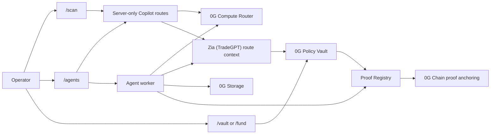

# 4lpha 0G

0G-native autonomous trading agent experience for AI-assisted discovery, policy-vault execution, and proof-backed agent workflows.

[](https://nextjs.org)
[](https://www.typescriptlang.org)
[](https://tailwindcss.com)
[](https://chainscan-galileo.0g.ai)
[](https://chainscan.0g.ai)

4lpha 0G centers the trading workflow on four connected surfaces:

- AI Scan
- Copilot
- Trading Agent
- Fund as a 0G Policy Vault

The product is designed to stand on its own as a 0G-native autonomous trading workspace.

---

## What is 4lpha 0G?

4lpha 0G is an autonomous trading workspace built around 0G Compute Router, 0G Storage, and 0G Chain proof anchoring.

The app is organized around practical operator flows:

| Surface | Description |
|---|---|
| AI Scan | 0G-powered token and wallet scanner for contract facts, risk signals, route context, and policy-ready evidence packets. |
| Copilot | Embedded chat for reasoning, policy review, and trade assistance powered through server-only routes, with executable trade commands routed through Zia (TradeGPT) context before Policy Vault submission. |
| Trading Agent | Agent setup, run review, status, execution logs, and policy-aware trade actions using Zia (TradeGPT) route context plus 0G Policy Vault enforcement. |
| Fund / Vault | 0G Policy Vault funding, limits, executor controls, pause/revoke, proof links, and withdrawals. |

Copilot is intentionally embedded in AI Scan and Agents. This repo does not introduce a standalone `/copilot` product surface.

---

## 0G Product Path

The main demo path should use 0G for real work:

- 0G Compute Router for reasoning and Copilot responses.
- Zia (TradeGPT) route context for executable quote and route selection.
- 0G Storage for redacted audit bundles and run evidence.
- 0G Chain Galileo testnet for proof anchoring during demo flows.
- 0G Policy Vault contracts for bounded trade execution and fund control.

### High-level flow



---

## Deployed 0G Contracts

The current vault path uses deployed 0G contracts and curated routes rather than a legacy smart-account or arbitrary executor path. Mainnet is multi-user: the app resolves each connected wallet's vault through `PolicyVaultFactoryV2.vaultOf(wallet)`. A new user creates a new vault instance from the deployed V2 factory; the factory, adapter, proof registry, and AgenticID contracts do not need to be redeployed for each user.

`PolicyVaultFactoryV2` (version `2`) is the active factory and the source of truth for new vault creation. `PolicyVaultFactory` (V1) remains deployed as a legacy factory: the app still discovers V1 vaults so existing operators keep working, and offers an in-app migration from a V1 vault to a V2 vault. The V2 vault adds agent-scoped positions: every trade request carries a `bytes32 agentKey`, so trades and exposure are tracked per agent inside one owner vault instead of one vault per agent.

### 0G Mainnet

| Contract | Address | Purpose |
|---|---|---|
| PolicyVaultFactoryV2 | [`0xc9CA07dc92eEf55aFB4d83BBffb9E8EFc5c0036f`](https://chainscan.0g.ai/address/0xc9CA07dc92eEf55aFB4d83BBffb9E8EFc5c0036f) | Active per-owner vault factory (version `2`). Agent-scoped vault creation and discovery via `vaultOf(wallet)`. |
| PolicyVaultFactory (V1, legacy) | [`0x9bcb67FE731c6eB1ed0c51f1b821100CC8CE25C4`](https://chainscan.0g.ai/address/0x9bcb67FE731c6eB1ed0c51f1b821100CC8CE25C4) | Legacy per-owner vault factory. Still discovered for existing vaults; new vaults are created through V2 with an in-app migration path. |
| ProofRegistry | [`0xfe87d95B76E297Bb28b0eC4dD72b15cfC2b14E7a`](https://chainscan.0g.ai/address/0xfe87d95B76E297Bb28b0eC4dD72b15cfC2b14E7a) | Anchors audit roots, policy hashes, model metadata hashes, and vault action hashes. |
| CuratedUniswapV3RouteAdapter | [`0xfaa8A8e03307dd901054E16Ee89189d006DBf6Db`](https://chainscan.0g.ai/address/0xfaa8A8e03307dd901054E16Ee89189d006DBf6Db) | Real mainnet adapter for allowlisted ZIA/Oku routes, tokens, pools, routers, and selectors. |
| AgenticID | [`0x058c5f4c72810d7d4fc0bef3875a8f779de7e59c`](https://chainscan.0g.ai/address/0x058c5f4c72810d7d4fc0bef3875a8f779de7e59c) | Canonical ERC-7857 identity record (ERC-165 `supportsInterface`) for agent, vault, executor, and storage references. |

Example owner vault: [`0xE4c802B58993e49bEFe824ec0765e1128586dB2A`](https://chainscan.0g.ai/address/0xE4c802B58993e49bEFe824ec0765e1128586dB2A). This is a V1 demo/operator vault instance, not a global vault for every user; new vaults are created through the V2 factory above.

Agentic ID is mainnet-only (chain ID `16661`). There is no Galileo/testnet Agentic ID deployment or smoke path; Galileo is used only for vault/adapter/proof smoke. Agentic ID mint requires `OG_NETWORK=mainnet`, `OG_CHAIN_ID=16661`, and `ENABLE_MAINNET_DEPLOY=true`. The re-key transfer path (`iTransfer`/`iClone`) requires a real TEE/ZKP verifier and is disabled in the server layer until one is wired.

Mainnet policy defaults for new vault instances: per-trade cap `5 0G`, daily cap `25 0G`, max exposure `25 0G`, default min-out `9950` bps, deadline window `900` seconds, and cooldown `0` seconds. Mainnet vaults allow `8` route tokens across `11` curated routes.

For deployment and operations:

- `NEXT_PUBLIC_POLICY_VAULT_FACTORY_V2_MAINNET_ADDRESS` is the required multi-user vault discovery entrypoint (active V2 factory). `NEXT_PUBLIC_POLICY_VAULT_FACTORY_V2_MAINNET_FROM_BLOCK` scopes event discovery.
- `NEXT_PUBLIC_POLICY_VAULT_FACTORY_MAINNET_ADDRESS` is the legacy V1 factory, still read so existing V1 vaults stay discoverable and can be migrated to V2.
- `NEXT_PUBLIC_POLICY_VAULT_MAINNET_ADDRESS` / `POLICY_VAULT_MAINNET_ADDRESS` are optional demo or script fallbacks, not the user vault source of truth.
- `DEPLOYER_PRIVATE_KEY` is the server-side proof and AgenticID minter key; it is not the owner key for every user's vault.
- `VAULT_EXECUTOR_PRIVATE_KEY` controls the bounded executor address configured into each vault.

### 0G Galileo Smoke Deployment

| Contract | Address | Purpose |
|---|---|---|
| PolicyVault | [`0xC4313B4ab3Ff969542Dc1dEC9ef0A6B697eb949C`](https://chainscan-galileo.0g.ai/address/0xC4313B4ab3Ff969542Dc1dEC9ef0A6B697eb949C) | Testnet smoke vault used for the deposit, buy, sell, pause, revoke, and withdraw path. |
| PolicyVaultFactory | [`0x961205be651f9378bbb628e1d609ae79970fc2b0`](https://chainscan-galileo.0g.ai/address/0x961205be651f9378bbb628e1d609ae79970fc2b0) | Testnet factory for smoke vault creation. |
| ProofRegistry | [`0xb58bf66df9f7620878ba5b894086655c8ae10da4`](https://chainscan-galileo.0g.ai/address/0xb58bf66df9f7620878ba5b894086655c8ae10da4) | Testnet proof anchor for smoke buy/sell proofs. |
| MockDexAdapter | [`0x6b8fe9aae525997d81208681299ad5ef347332fd`](https://chainscan-galileo.0g.ai/address/0x6b8fe9aae525997d81208681299ad5ef347332fd) | Test-only adapter for the first Galileo smoke flow. |
| MockAssetToken | [`0x9eaa37b76633181203b3c09da1aadf8c23fbc8e7`](https://chainscan-galileo.0g.ai/address/0x9eaa37b76633181203b3c09da1aadf8c23fbc8e7) | Test-only token used by the mock adapter path. |

Production and public mainnet flows must use `ENABLE_REAL_DEX_ADAPTER=true` and `ENABLE_MOCK_DEX_ADAPTER=false`.

---

## Quick Start

```bash
git clone <your-repo-url>
cd 4lpha-0G
npm install
cp .env.example .env.local
npm run dev
```

Open [http://localhost:3000](http://localhost:3000).

If you only want the web app and API routes without the local worker supervisor, use:

```bash
npm run dev:app
```

For contract work:

```bash
npm run contracts:compile
npm run contracts:test
```

For app checks:

```bash
npm run build
npm run lint
```

---

## Product Surfaces

### AI Scan

`/scan` opens the 4lpha AI Smart Scan workspace for token and wallet scanning. It combines deterministic RPC facts with 0G Compute Router analysis to produce a readable risk report, local evidence root, route context, and policy-ready scan packet.

`/discover` is kept as a compatibility route and redirects to `/scan`. `/` currently redirects to `/agents`.

### Copilot

Copilot is available as an embedded chat rail inside AI Scan and Agents. All LLM calls should go through server-side routes and the 0G Compute Router integration.

For executable trade commands, Copilot uses Zia (TradeGPT) route context for quote and route selection, then submits only allowlisted buy/sell requests through the 0G Policy Vault. The vault remains the on-chain enforcement layer for spend caps, min-out, deadlines, executor scope, and proof binding.

### Agents

`/agents` is the trading agent workspace. It covers:

- Agent creation and setup
- Run review and status
- Audit evidence and proof references
- Policy visibility
- Trade execution through Zia (TradeGPT) routes, with Policy Vault checks before any executor transaction
- Embedded Copilot support

### Fund / Vault

`/fund` and `/vault` provide the 0G Policy Vault surface. It covers:

- Vault funding
- Policy controls
- Executor status
- Pause and revoke controls
- Proof links and verification state
- Withdrawal flow for the owner

---

## Stack

| Layer | Technology |
|---|---|
| Framework | Next.js 16 App Router |
| Language | TypeScript 6 strict mode |
| UI | React 19 and Tailwind CSS 4 |
| Chain | 0G Galileo testnet by default, 0G mainnet when explicitly configured |
| Wallet | `viem` and `wagmi` |
| Contracts | Hardhat + Solidity 0.8.19 |
| Storage | `@0gfoundation/0g-storage-ts-sdk` |
| Validation | `zod` |
| Runtime | Server routes plus a long-lived agent worker |

---

## Local Development

Prerequisites:

- Node.js 20+
- npm
- A populated `.env.local`
- Access to the 0G endpoints you plan to use

Run the app:

```bash
npm run dev
```

Run the web app only:

```bash
npm run dev:app
```

Build and start production locally:

```bash
npm run build
npm run start
```

---

## Environment Variables

Copy `.env.example` to `.env.local` and keep real values out of git.

### App and Network

```env
NEXT_PUBLIC_APP_URL=http://localhost:3000
OG_CHAIN_ID=16602
OG_RPC_URL=https://evmrpc-testnet.0g.ai
OG_EXPLORER_URL=https://chainscan-galileo.0g.ai
OG_NETWORK=testnet
```

### 0G Compute

```env
OG_COMPUTE_BASE_URL=
OG_COMPUTE_ROUTER_API_KEY=
OG_COMPUTE_API_KEY=
OG_COMPUTE_ALLOWED_HOSTS=
OG_COMPUTE_MODEL=
OG_COMPUTE_MODELS=
OG_COMPUTE_MAX_TOKENS=900
OG_COMPUTE_VERIFY_TEE=false
```

Use server-only secrets for Compute Router access. Do not expose them through `NEXT_PUBLIC_*`, logs, or browser storage.

### 0G Storage

```env
OG_STORAGE_INDEXER_URL=https://indexer-storage-testnet-turbo.0g.ai
OG_STORAGE_RPC_URL=https://evmrpc-testnet.0g.ai
```

### Vault and Proofs

```env
DEPLOYER_PRIVATE_KEY=
VAULT_EXECUTOR_PRIVATE_KEY=
POLICY_VAULT_ADDRESS=
POLICY_VAULT_MAINNET_ADDRESS=
PROOF_REGISTRY_ADDRESS=
AGENT_IDENTITY_ADDRESS=
AGENT_IDENTITY_MAINNET_ADDRESS=
NEXT_PUBLIC_POLICY_VAULT_FACTORY_V2_MAINNET_ADDRESS=
NEXT_PUBLIC_POLICY_VAULT_FACTORY_V2_MAINNET_FROM_BLOCK=
```

### Feature Flags

```env
ENABLE_REAL_DEX_ADAPTER=false
ENABLE_MOCK_DEX_ADAPTER=true
ENABLE_MAINNET_DEPLOY=false
AGENT_TRADE_LIVE_ENABLED=false
OG_AGENT_WORKER_EXECUTE=false
OG_AGENT_WORKER_KILL_SWITCH=false
MAINNET_CREATE_VAULT=false
```

`ENABLE_MOCK_DEX_ADAPTER` is appropriate for local and demo work. Production or public testnet configurations should fail closed if a mock adapter is selected.

---

## Project Structure

```text
app/
  page.tsx                    Redirects to the Agents workspace
  scan/                       AI Scan workspace route
  discover/                   Compatibility redirect to AI Scan
  agents/                     Trading agent workspace and setup flow
  vault/ and fund/            0G Policy Vault surfaces
  api/                        Server routes for Copilot, agents, AI scan, and trade flows

components/
  app/                        Shared product UI pieces
  agents/                     Agent workspace components
  wallet/                     Wallet connection UI
  surfaces/                   High-level page surfaces

lib/
  agent/                      Agent runtime, trade service, and worker logic
  copilot/                    Copilot routing, gating, and audit helpers
  og/                         0G network and storage helpers
  trading/                    Scan and quote helpers
  contracts/                  Contract-facing helpers and curated route data
  types/                      Shared TypeScript contracts

contracts/
  PolicyVault.sol             Deny-by-default vault contract (V1, legacy)
  PolicyVaultFactory.sol      Vault factory (V1, legacy)
  PolicyVaultV2.sol           Deny-by-default vault with agent-scoped positions (V2, active)
  PolicyVaultFactoryV2.sol    Per-owner vault factory (V2, active)
  ProofRegistry.sol           Proof anchoring and lookup
  AgenticID.sol               Agent identity / proof registry path
  mocks/                      Local-only mock and malicious test contracts

scripts/
  dev-local.ts                Local supervisor
  og-agent-worker.ts          Agent worker
  smoke-storage.ts            0G Storage smoke check
  smoke-galileo.ts            Galileo testnet smoke flow
  preflight.ts                Trade / vault preflight
```

Shared contracts and interfaces live in `lib/types/` and `contracts/interfaces/`. Prefer those over redeclaring shapes in multiple places.

---

## Verification

Run the narrowest reliable checks after changes:

- App or type changes:
  - `npm run build`
  - `npx tsc --noEmit`
- Contract changes:
  - `npm run contracts:compile`
  - `npm run contracts:test`
- Storage or worker changes:
  - `npm run smoke:storage`
  - `npm run smoke:ai-scan`

Recommended smoke paths for the 0G demo:

1. One live 0G Compute call through a server route.
2. One 0G Storage upload with verified retrieval or root output.
3. One 0G Chain Galileo testnet transaction anchoring proof.
4. Vault deposit.
5. Policy update.
6. Executor buy through the mock adapter.
7. Executor sell through the mock adapter.
8. Pause.
9. Revoke executor.
10. Owner withdraw.

---

## Security

- Never hardcode API keys, private keys, RPC credentials, wallet material, or cookies.
- Never expose secrets through `NEXT_PUBLIC_*`, screenshots, logs, fixtures, or browser storage.
- Keep all 0G Compute Router calls server-side.
- Store redacted audit bundles only, not raw secrets or unredacted provider payloads.
- Treat executor power as compromised by default and bound it on-chain.
- Use allowlisted adapters and narrow vault methods only.

If a secret is committed or leaked, rotate it and remove it through the appropriate team process.

---

## License

MIT
