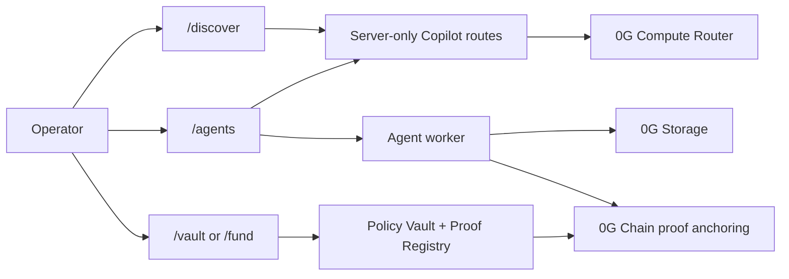

# 4lpha 0G

0G-native autonomous trading agent experience for the 0G Zero Cup hackathon.

[](https://nextjs.org)
[](https://www.typescriptlang.org)
[](https://tailwindcss.com)
[](https://chainscan-galileo.0g.ai)

4lpha 0G rebuilds the product around the 0G stack instead of legacy assumptions from the previous product line. The app centers on four surfaces:

- Discover
- Copilot
- Trading Agent
- Fund as a 0G Policy Vault

The repo is designed to stand on its own as a public demo and hackathon submission.

---

## Quick Start

```bash
git clone <your-repo-url>
cd 4lpha-0G
npm install
cp .env.example .env.local
npm run dev
```

Open [http://localhost:3000](http://localhost:3000).

If you only want the web app and API routes without the local worker supervisor, use:

```bash
npm run dev:app
```

For contract work:

```bash
npm run contracts:compile
npm run contracts:test
```

For app checks:

```bash
npm run build
npm run lint
```

---

## What is 4lpha 0G?

4lpha 0G is an autonomous trading workspace built around 0G Compute Router, 0G Storage, and 0G Chain proof anchoring.

The app is organized around practical operator flows:

| Surface | Description |
|---|---|
| Discover | 0G-focused workspace for market context, token inspection, and operator decisions. |
| Copilot | Embedded chat for reasoning, policy review, and trade assistance powered through server-only routes. |
| Trading Agent | Agent setup, run review, status, execution logs, and policy-aware trade actions. |
| Fund / Vault | 0G Policy Vault funding, limits, executor controls, pause/revoke, proof links, and withdrawals. |

Copilot is intentionally embedded in Discover and Agents. This repo does not introduce a standalone `/copilot` page.

---

## 0G Product Path

The main demo path should use 0G for real work:

- 0G Compute Router for reasoning and Copilot responses.
- 0G Storage for redacted audit bundles and run evidence.
- 0G Chain Galileo testnet for proof anchoring during demo flows.
- 0G Policy Vault contracts for bounded trade execution and fund control.

### High-level flow



---

## Product Surfaces

### Discover

`/` and `/discover` open the 0G Discover workspace. It is the main first-screen surface for market context and Copilot-assisted decisions.

### Copilot

Copilot is available as an embedded chat rail inside Discover and Agents. All LLM calls should go through server-side routes and the 0G Compute Router integration.

### Agents

`/agents` is the trading agent workspace. It covers:

- Agent creation and setup
- Run review and status
- Audit evidence and proof references
- Policy visibility
- Embedded Copilot support

### Fund / Vault

`/fund` and `/vault` provide the 0G Policy Vault surface. It covers:

- Vault funding
- Policy controls
- Executor status
- Pause and revoke controls
- Proof links and verification state
- Withdrawal flow for the owner

---

## Stack

| Layer | Technology |
|---|---|
| Framework | Next.js 16 App Router |
| Language | TypeScript 6 strict mode |
| UI | React 19 and Tailwind CSS 4 |
| Chain | 0G Galileo testnet by default, 0G mainnet when explicitly configured |
| Wallet | `viem` and `wagmi` |
| Contracts | Hardhat + Solidity 0.8.19 |
| Storage | `@0gfoundation/0g-storage-ts-sdk` |
| Validation | `zod` |
| Runtime | Server routes plus a long-lived agent worker |

---

## Local Development

Prerequisites:

- Node.js 20+
- npm
- A populated `.env.local`
- Access to the 0G endpoints you plan to use

Run the app:

```bash
npm run dev
```

Run the web app only:

```bash
npm run dev:app
```

Build and start production locally:

```bash
npm run build
npm run start
```

---

## Environment Variables

Copy `.env.example` to `.env.local` and keep real values out of git.

### App and Network

```env
NEXT_PUBLIC_APP_URL=http://localhost:3000
OG_CHAIN_ID=16602
OG_RPC_URL=https://evmrpc-testnet.0g.ai
OG_EXPLORER_URL=https://chainscan-galileo.0g.ai
OG_NETWORK=testnet
```

### 0G Compute

```env
OG_COMPUTE_BASE_URL=
OG_COMPUTE_ROUTER_API_KEY=
OG_COMPUTE_API_KEY=
OG_COMPUTE_ALLOWED_HOSTS=
OG_COMPUTE_MODEL=
OG_COMPUTE_MODELS=
OG_COMPUTE_MAX_TOKENS=900
OG_COMPUTE_VERIFY_TEE=false
```

Use server-only secrets for Compute Router access. Do not expose them through `NEXT_PUBLIC_*`, logs, or browser storage.

### 0G Storage

```env
OG_STORAGE_INDEXER_URL=https://indexer-storage-testnet-turbo.0g.ai
OG_STORAGE_RPC_URL=https://evmrpc-testnet.0g.ai
```

### Vault and Proofs

```env
DEPLOYER_PRIVATE_KEY=
VAULT_EXECUTOR_PRIVATE_KEY=
POLICY_VAULT_ADDRESS=
POLICY_VAULT_MAINNET_ADDRESS=
PROOF_REGISTRY_ADDRESS=
AGENT_IDENTITY_ADDRESS=
```

### Feature Flags

```env
ENABLE_REAL_DEX_ADAPTER=false
ENABLE_MOCK_DEX_ADAPTER=true
ENABLE_MAINNET_DEPLOY=false
AGENT_TRADE_LIVE_ENABLED=false
OG_AGENT_WORKER_EXECUTE=false
OG_AGENT_WORKER_KILL_SWITCH=false
MAINNET_CREATE_VAULT=false
```

`ENABLE_MOCK_DEX_ADAPTER` is appropriate for local and demo work. Production or public testnet configurations should fail closed if a mock adapter is selected.

---

## Project Structure

```text
app/
  page.tsx                    Discover landing surface
  discover/                   Discover workspace route
  agents/                     Trading agent workspace and setup flow
  vault/ and fund/            0G Policy Vault surfaces
  api/                        Server routes for Copilot, agents, AI scan, and trade flows

components/
  app/                        Shared product UI pieces
  agents/                     Agent workspace components
  wallet/                     Wallet connection UI
  surfaces/                   High-level page surfaces

lib/
  agent/                      Agent runtime, trade service, and worker logic
  copilot/                    Copilot routing, gating, and audit helpers
  og/                         0G network and storage helpers
  trading/                    Scan and quote helpers
  contracts/                  Contract-facing helpers and curated route data
  types/                      Shared TypeScript contracts

contracts/
  PolicyVault.sol             Deny-by-default vault contract
  PolicyVaultFactory.sol      Vault factory
  ProofRegistry.sol           Proof anchoring and lookup
  AgenticID.sol               Agent identity / proof registry path
  mocks/                      Local-only mock and malicious test contracts

scripts/
  dev-local.ts                Local supervisor
  og-agent-worker.ts          Agent worker
  smoke-storage.ts            0G Storage smoke check
  smoke-galileo.ts            Galileo testnet smoke flow
  preflight.ts                Trade / vault preflight
```

Shared contracts and interfaces live in `lib/types/` and `contracts/interfaces/`. Prefer those over redeclaring shapes in multiple places.

---

## Verification

Run the narrowest reliable checks after changes:

- App or type changes:
  - `npm run build`
  - `npx tsc --noEmit`
- Contract changes:
  - `npm run contracts:compile`
  - `npm run contracts:test`
- Storage or worker changes:
  - `npm run smoke:storage`
  - `npm run smoke:ai-scan`

Recommended smoke paths for the 0G demo:

1. One live 0G Compute call through a server route.
2. One 0G Storage upload with verified retrieval or root output.
3. One 0G Chain Galileo testnet transaction anchoring proof.
4. Vault deposit.
5. Policy update.
6. Executor buy through the mock adapter.
7. Executor sell through the mock adapter.
8. Pause.
9. Revoke executor.
10. Owner withdraw.

---

## Security

- Never hardcode API keys, private keys, RPC credentials, wallet material, or cookies.
- Never expose secrets through `NEXT_PUBLIC_*`, screenshots, logs, fixtures, or browser storage.
- Keep all 0G Compute Router calls server-side.
- Store redacted audit bundles only, not raw secrets or unredacted provider payloads.
- Treat executor power as compromised by default and bound it on-chain.
- Use allowlisted adapters and narrow vault methods only.

If a secret is committed or leaked, rotate it and remove it through the appropriate team process.

---

## License

MIT
