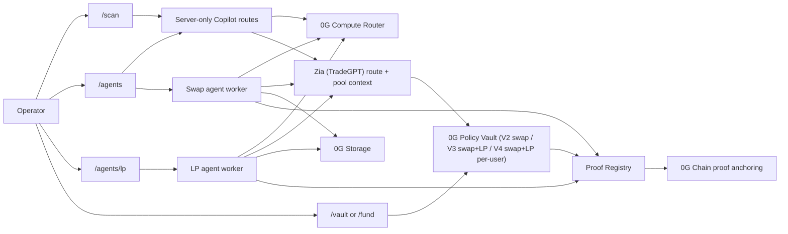

# 4lpha 0G

0G-native autonomous trading agent experience for AI-assisted discovery, policy-vault execution, and proof-backed agent workflows.

[](https://nextjs.org)
[](https://www.typescriptlang.org)
[](https://tailwindcss.com)
[](https://chainscan-galileo.0g.ai)
[](https://chainscan.0g.ai)

4lpha 0G centers the trading workflow on five connected surfaces:

- AI Scan
- Copilot
- Trading Agent
- LP Agent (0G-native Zia/TradeGPT LP, autonomous mint + stake through Policy Vault V3/V4)
- Fund as a 0G Policy Vault

The product is designed to stand on its own as a 0G-native autonomous trading workspace.

---

## What is 4lpha 0G?

4lpha 0G is an autonomous trading workspace built around 0G Compute Router, 0G Storage, and 0G Chain proof anchoring.

The app is organized around practical operator flows:

| Surface | Description |
|---|---|
| AI Scan | 0G-powered token and wallet scanner for contract facts, risk signals, route context, and policy-ready evidence packets. |
| Copilot | Embedded chat for reasoning, policy review, and trade assistance powered through server-only routes, with executable trade commands routed through Zia (TradeGPT) context before Policy Vault submission. |
| Trading Agent | Agent setup, run review, status, execution logs, and policy-aware trade actions using Zia (TradeGPT) route context plus 0G Policy Vault enforcement. |
| LP Agent | 0G-native Zia/TradeGPT LP agent: the 0G Compute Router picks the pool/range, the Policy Vault (V3 or V4) enforces the on-chain fence (allowlisted pools, per-action/daily cap, max exposure, min-out, cooldown), and the vault mints + auto-stakes the LP NFT into the matching Zia vault so advertised APR is actually earned. Manual unstake / zap-out / owner withdraw are exposed as explicit controls. |
| Fund / Vault | 0G Policy Vault funding, limits, executor controls, pause/revoke, proof links, and withdrawals. V2 is the multi-user swap vault; V3 adds the LP primitive layer and is deployer/owner-only; V4 (in progress) brings the LP layer back to a per-user vault. |

Copilot is intentionally embedded in AI Scan and Agents. This repo does not introduce a standalone `/copilot` product surface.

---

## 0G Product Path

The main demo path should use 0G for real work:

- 0G Compute Router for reasoning, Copilot responses, and the LP agent's pool/range selection.
- Zia (TradeGPT) route context for executable quote and route selection, and Zia pool discovery for LP.
- 0G Storage for redacted audit bundles and run evidence.
- 0G Chain Galileo testnet for proof anchoring during demo flows (V3/V4 LP and Agentic ID are mainnet-only).
- 0G Policy Vault contracts (V2 swap for all users; V3 swap + LP, deployer/owner-only; V4 swap + LP, per-user, in progress) for bounded trade execution and fund control.

### High-level flow



---

## Deployed 0G Contracts

The vault path uses deployed 0G contracts and curated routes rather than a legacy smart-account or arbitrary executor path. There are three vault versions on mainnet:

- **V2 (multi-user, swap-only).** The app resolves each connected wallet's vault through `PolicyVaultFactoryV2.vaultOf(wallet)`. A new user creates a new vault instance from the deployed V2 factory; the factory, adapter, proof registry, and AgenticID contracts do not need to be redeployed for each user. V2 is the vault for every browser user — trading agent, deposit, Copilot, AI scan.
- **V3 (singleton, deployer/owner-only, swap + LP).** V3 preserves the V2 swap surface byte-for-byte and adds the LP primitive layer (`zapInMintLp`, `stakeLp`, `unstakeLp`, `zapOut`, and a reserved `claimRewards` slot that reverts `RewardsNotConfigured` until Zia ships a claim ABI). V3 is **owner-only by design**: there is no on-chain V3 factory on 0G mainnet (`PolicyVaultFactoryV3` exceeds EIP-170's 24KB deployed-bytecode cap, so it is retained for EDR/local tests only). The deployer/server deploys a V3 singleton directly via `scripts/create-mainnet-vault-v3.ts` and tracks `owner => vaultAddress` in an off-chain registry (`.data/deployments/mainnet-policy-vault-v3-registry.json`). The server resolver `resolveMainnetV3VaultForOwner` returns the V3 vault only for the deployer (registry/env entry) and falls back to V2 for everyone else. The LP Agent gates on `vaultVersion >= 3 && lpAdapter != address(0)`.
- **V4 (per-user, three-way split, in progress).** V4 brings the LP layer back to a per-user vault instead of V3's deployer-only singleton. Each owner gets a trio — `PolicyVaultV4Swap` + `PolicyVaultV4LpEntry` + `PolicyVaultV4LpExit` — deployed from the UI with the connected wallet and registered in a shared `VaultRegistryV4` (`registerSwap`/`registerLpEntry`/`registerLpExit(vault)`, owner-called and unspoofable — self-registration was rejected in review because a fake contract's `owner()` could impersonate the victim). The trio keeps every V2 swap and V3 LP capability plus a guided V1/V2/V3 → V4 migration flow (`/api/vault/migrate-v4`). Shared infra (`VaultRegistryV4`, `ZiaLpAdapterV4`) is deployed on 0G mainnet and the swap third has executed a real trade end-to-end; the LP entry/exit thirds and the in-app migration flow are still being hardened on the `fix/vault-v4-blockers` branch and are not yet the default path for new users — treat V4 as active development, not a finished surface, until this section is updated again.

`PolicyVaultFactoryV2` (version `2`) is the active factory and the source of truth for new V2 vault creation. `PolicyVaultFactory` (V1) remains deployed as a legacy factory: the app still discovers V1 vaults so existing operators keep working, and offers an in-app migration from a V1 vault to a V2 vault. The V2 vault adds agent-scoped positions: every trade request carries a `bytes32 agentKey`, so trades and exposure are tracked per agent inside one owner vault instead of one vault per agent.

### 0G Mainnet

| Contract | Address | Purpose |
|---|---|---|
| PolicyVaultV3 | [`0x599bf69f54BAEF47C3A23cA85C5BC1Ef74868D29`](https://chainscan.0g.ai/address/0x599bf69f54BAEF47C3A23cA85C5BC1Ef74868D29) | Active V3 singleton (version `3`, deployer/owner-only). Swap surface (V2 verbatim) + LP primitives (`zapInMintLp`/`stakeLp`/`unstakeLp`/`zapOut`/reserved `claimRewards`). LP allowlists, LP caps, and pool→stake-vault bindings are seeded at construction; admin can only tighten/disable, never loosen or re-add. |
| ZiaLpAdapter | [`0xC357e548e2E3f7A6831a18A640F2BE2b25453816`](https://chainscan.0g.ai/address/0xC357e548e2E3f7A6831a18A640F2BE2b25453816) | Real mainnet LP adapter for allowlisted Zia Uniswap-V3 pools. Narrow: one `swapExactIn` + `NFPM.mint`/`increaseLiquidity`/`decreaseLiquidity`/`collect`/`burn` through immutable NFPM/swap router/W0G, recipient hard-pinned to the vault. No arbitrary calldata pass-through. |
| PolicyVaultFactoryV2 | [`0xc9CA07dc92eEf55aFB4d83BBffb9E8EFc5c0036f`](https://chainscan.0g.ai/address/0xc9CA07dc92eEf55aFB4d83BBffb9E8EFc5c0036f) | Active per-owner V2 vault factory (version `2`). Agent-scoped vault creation and discovery via `vaultOf(wallet)`. |
| PolicyVaultFactory (V1, legacy) | [`0x9bcb67FE731c6eB1ed0c51f1b821100CC8CE25C4`](https://chainscan.0g.ai/address/0x9bcb67FE731c6eB1ed0c51f1b821100CC8CE25C4) | Legacy per-owner vault factory. Still discovered for existing vaults; new vaults are created through V2 with an in-app migration path. |
| ProofRegistry | [`0xfe87d95B76E297Bb28b0eC4dD72b15cfC2b14E7a`](https://chainscan.0g.ai/address/0xfe87d95B76E297Bb28b0eC4dD72b15cfC2b14E7a) | Anchors audit roots, policy hashes, model metadata hashes, and vault action hashes. Shared by V2 and V3. |
| CuratedUniswapV3RouteAdapter | [`0xfaa8A8e03307dd901054E16Ee89189d006DBf6Db`](https://chainscan.0g.ai/address/0xfaa8A8e03307dd901054E16Ee89189d006DBf6Db) | Real mainnet swap adapter for allowlisted ZIA/Oku routes, tokens, pools, routers, and selectors. Wired as the V3 swap adapter immutable. |
| AgenticID | [`0x058c5f4c72810d7d4fc0bef3875a8f779de7e59c`](https://chainscan.0g.ai/address/0x058c5f4c72810d7d4fc0bef3875a8f779de7e59c) | Canonical ERC-7857 identity record (ERC-165 `supportsInterface`) for agent, vault, executor, and storage references. |

**V4 shared infra (0G Mainnet, in progress — see `fix/vault-v4-blockers`).** V4 does not have fixed swap/LP-entry/LP-exit vault addresses like V3: each owner's trio is deployed on demand and looked up through the registry (`VaultRegistryV4.vaultOf(owner)` → `(swapVault, lpEntryVault, lpExitVault)`). Only the registry itself and the LP adapter are shared singletons:

| Contract | Address | Purpose |
|---|---|---|
| VaultRegistryV4 | [`0x222A47639E74bf738711dfF65D192D434A10F2d0`](https://chainscan.0g.ai/address/0x222A47639E74bf738711dfF65D192D434A10F2d0) | Maps `owner => (swapVault, lpEntryVault, lpExitVault)`. Registration is owner-called (`register*(vault)`, checked against `IOwnable(vault).owner() == msg.sender`), not self-registration, to close a spoofing path where a fake contract's `owner()` could claim another owner's slot. |
| ZiaLpAdapterV4 | [`0x032726ada42a1E13B6999e24051F782a2a4aFEC3`](https://chainscan.0g.ai/address/0x032726ada42a1E13B6999e24051F782a2a4aFEC3) | V4's LP adapter for allowlisted Zia Uniswap-V3 pools, same narrow shape as the V3 `ZiaLpAdapter` (immutable NFPM/swap router/W0G, recipient hard-pinned to the calling vault). |

The V4 Swap third reuses the existing `CuratedUniswapV3RouteAdapter` (same address as the V3 swap adapter above) — V4 only introduces a new contract for the LP side.

Zia mainnet constants (address-only, public; mirrored in `lib/contracts/zia-lp.ts`): Zia NFT Position Manager `0x5143ba6007C197b4cF66c20601b9dB97E0F98c6A`, Zia Swap Router `0x18cCa38E51c4C339A6BD6e174025f08360FEEf30`, Zia Quoter V2 `0x23b55293b7F06F6c332a0dDA3D88d8921218425B`, Zia Uniswap V3 Factory `0x6F3945Ab27296D1D66D8EEb042ff1B4fb2E0CE70`.

Example owner vault: [`0xE4c802B58993e49bEFe824ec0765e1128586dB2A`](https://chainscan.0g.ai/address/0xE4c802B58993e49bEFe824ec0765e1128586dB2A). This is a V1 demo/operator vault instance, not a global vault for every user; new vaults are created through the V2 factory above.

**Owner vs executor (V3 demo).** For the V3 singleton, the deployer wallet `0xd7e004cbda24e079aa3a657ba7f8e2915192a966` is the **owner** (pays gas, controls vault admin: deposit, withdraw, pause, revoke, tighten policy, enable/disable agent keys, LP allowlists). `0xf56bd1db9f423ed36224ac70751d1315c2b8f737` is the **executor** key (bounded by policy; assumed compromise-able). Never confuse the two. `depositNative`/`withdrawNative`/`rescueNft`/`unstakeLpOwner`/`tightenPolicy`/`setAgentKeyEnabled` are `onlyOwner`; `buy`/`sell`/`zapInMintLp`/`stakeLp`/`unstakeLp`/`zapOut` are `onlyExecutor` + `executorActive`.

Agentic ID is mainnet-only (chain ID `16661`). There is no Galileo/testnet Agentic ID deployment or smoke path; Galileo is used only for vault/adapter/proof smoke. Agentic ID mint requires `OG_NETWORK=mainnet`, `OG_CHAIN_ID=16661`, and `ENABLE_MAINNET_DEPLOY=true`. The re-key transfer path (`iTransfer`/`iClone`) requires a real TEE/ZKP verifier and is disabled in the server layer until one is wired.

Mainnet policy defaults for new V2 vault instances: per-trade cap `5 0G`, daily cap `25 0G`, max exposure `25 0G`, default min-out `9950` bps, deadline window `900` seconds, and cooldown `0` seconds. Mainnet V2 vaults allow `8` route tokens across `11` curated routes. V3 LP policy defaults (read by `scripts/create-mainnet-vault-v3.ts`): per-LP-action cap `2 0G`, LP daily cap `10 0G`, max LP exposure `15 0G`, LP cooldown `0` s, LP min-out `9500` bps, min liquidity floor `1_000_000`, and `allowStaking=true`. LP exposure is tracked separately from swap exposure so each cap is independently tunable.

For deployment and operations:

- `NEXT_PUBLIC_POLICY_VAULT_FACTORY_V2_MAINNET_ADDRESS` is the required multi-user V2 vault discovery entrypoint (active V2 factory). `NEXT_PUBLIC_POLICY_VAULT_FACTORY_V2_MAINNET_FROM_BLOCK` scopes event discovery.
- `NEXT_PUBLIC_POLICY_VAULT_FACTORY_MAINNET_ADDRESS` is the legacy V1 factory, still read so existing V1 vaults stay discoverable and can be migrated to V2.
- `POLICY_VAULT_V3_MAINNET_ADDRESS` / `NEXT_PUBLIC_POLICY_VAULT_V3_MAINNET_ADDRESS` is the V3 singleton address used by the server resolver and LP Agent. There is **no on-chain V3 factory** on mainnet; V3 vaults are deployed as singletons via `npm run vault:mainnet:create:v3` and tracked in the off-chain registry.
- `POLICY_VAULT_ZIA_LP_ADAPTER_MAINNET_ADDRESS` / `NEXT_PUBLIC_POLICY_VAULT_ZIA_LP_ADAPTER_MAINNET_ADDRESS` is the deployed ZiaLpAdapter singleton.
- `NEXT_PUBLIC_POLICY_VAULT_MAINNET_ADDRESS` / `POLICY_VAULT_MAINNET_ADDRESS` are optional demo or script fallbacks, not the user vault source of truth.
- `DEPLOYER_PRIVATE_KEY` is the server-side proof and AgenticID minter key, and for the V3 demo it is also the **vault owner** key. It is not the owner key for every V2 user's vault.
- `VAULT_EXECUTOR_PRIVATE_KEY` controls the bounded executor address configured into each vault.

### 0G Galileo Smoke Deployment

| Contract | Address | Purpose |
|---|---|---|
| PolicyVault | [`0xC4313B4ab3Ff969542Dc1dEC9ef0A6B697eb949C`](https://chainscan-galileo.0g.ai/address/0xC4313B4ab3Ff969542Dc1dEC9ef0A6B697eb949C) | Testnet smoke vault used for the deposit, buy, sell, pause, revoke, and withdraw path. |
| PolicyVaultFactory | [`0x961205be651f9378bbb628e1d609ae79970fc2b0`](https://chainscan-galileo.0g.ai/address/0x961205be651f9378bbb628e1d609ae79970fc2b0) | Testnet factory for smoke vault creation. |
| ProofRegistry | [`0xb58bf66df9f7620878ba5b894086655c8ae10da4`](https://chainscan-galileo.0g.ai/address/0xb58bf66df9f7620878ba5b894086655c8ae10da4) | Testnet proof anchor for smoke buy/sell proofs. |
| MockDexAdapter | [`0x6b8fe9aae525997d81208681299ad5ef347332fd`](https://chainscan-galileo.0g.ai/address/0x6b8fe9aae525997d81208681299ad5ef347332fd) | Test-only adapter for the first Galileo smoke flow. |
| MockAssetToken | [`0x9eaa37b76633181203b3c09da1aadf8c23fbc8e7`](https://chainscan-galileo.0g.ai/address/0x9eaa37b76633181203b3c09da1aadf8c23fbc8e7) | Test-only token used by the mock adapter path. |

Production and public mainnet flows must use `ENABLE_REAL_DEX_ADAPTER=true` and `ENABLE_MOCK_DEX_ADAPTER=false`. The V3 LP path additionally requires `MAINNET_ALLOW_MOCK_LP_ADAPTER=false` and a real `ZiaLpAdapter`; a mock LP adapter is rejected on mainnet.

### V3 and LP deployment scripts

There is no on-chain V3 factory on mainnet (EIP-170 cap). V3 vaults and the LP adapter are deployed as singletons from the deployer wallet, dry-run by default and gated by explicit env flags so they never broadcast by accident:

```bash
# Deploy the ZiaLpAdapter singleton (no-arg; NFPM/swap router/W0G are immutable constants).
# Gated by MAINNET_DEPLOY_ZIA_LP_ADAPTER=true; MAINNET_ZIA_LP_ADAPTER_REDEPLOY_FORCE=true to replace an existing adapter.
npm run deploy:vault:mainnet:zia-lp-adapter

# Deploy a V3 vault singleton for an owner and register it off-chain.
# Gated by MAINNET_CREATE_VAULT_V3=true; MAINNET_V3_REDEPLOY_FORCE=true when the registry is missing/empty.
npm run vault:mainnet:create:v3
```

`PolicyVaultFactoryV3` is retained in `contracts/` for the EDR `hardhatMainnet` network (`allowUnlimitedContractSize: true`) and the V3 test suite only; it is not part of the mainnet deploy path. `npx hardhat test test/PolicyVaultV3.ts --network hardhatMainnet` runs the V3 suite (V2 buy/sell roundtrip on V3, zap-mint + W0G-leg requirement, stake/unstake, exit-lockup guard, zap-out, `claimRewards` revert, replay/zero-min-out rejects, owner-bound factory).

After deploying a V3 vault, call `setAgentKeyEnabled(agentKey, true)` on-chain (owner signs) for each LP agent's key — `mintAgent` does **not** flip this flag, which is the root cause of "Copilot/agent can't trade".

---

## Quick Start

```bash
git clone <your-repo-url>
cd 4lpha-0G
npm install
cp .env.example .env.local
npm run dev
```

Open [http://localhost:3000](http://localhost:3000).

If you only want the web app and API routes without the local worker supervisor, use:

```bash
npm run dev:app
```

For contract work:

```bash
npm run contracts:compile
npm run contracts:test
```

For app checks:

```bash
npm run build
npm run lint
```

---

## Product Surfaces

### AI Scan

`/scan` opens the 4lpha AI Smart Scan workspace for token and wallet scanning. It combines deterministic RPC facts with 0G Compute Router analysis to produce a readable risk report, local evidence root, route context, and policy-ready scan packet.

`/discover` is kept as a compatibility route and redirects to `/scan`. `/` currently redirects to `/agents`.

### Copilot

Copilot is available as an embedded chat rail inside AI Scan and Agents. All LLM calls should go through server-side routes and the 0G Compute Router integration.

For executable trade commands, Copilot uses Zia (TradeGPT) route context for quote and route selection, then submits only allowlisted buy/sell requests through the 0G Policy Vault. The vault remains the on-chain enforcement layer for spend caps, min-out, deadlines, executor scope, and proof binding.

Market-overview questions are grounded with live data instead of relying on model recall: the server-side chat route calls the CoinMarketCap MCP endpoint (stateless `tools/call`, configured in `.mcp.json` + `CMC_API_KEY`) for price/market context, then hands that context to the 0G Compute Router, which stays the sole reasoning path. Grounding is optional — an empty `CMC_API_KEY` disables it and Copilot falls back to its framework prompt.

### Agents

`/agents` is the trading agent workspace. It covers:

- Agent creation and setup
- Run review and status
- Audit evidence and proof references
- Policy visibility
- Trade execution through Zia (TradeGPT) routes, with Policy Vault checks before any executor transaction
- Embedded Copilot support

### LP Agent

`/agents/create/lp` and `/agents/lp/[id]` are the 0G-native Zia/TradeGPT LP agent surfaces. The LP Agent is autonomous, not a manual-pick helper:

- **Decision layer** — at mint time the server loop calls Zia pool discovery, filters pools by the operator's APR band, and sends the candidate set + policy + market context to the 0G Compute Router, which returns `(pool, band, amount)`. The create form is filters-only (min/max APR, price-range policy, max positions, max 0G per position, initial deposit, LLM model) — there is no manual pool picker.
- **Enforcement layer** — Policy Vault V3 rejects any pool outside the allowlist, amount over per-action/daily cap, total over max exposure, `amountOutMin = 0`, cooldown violations, and non-W0G-leg pools (which are not single-sided zappable on V3). The LLM cannot violate policy regardless of its decision.
- **Lifecycle** — the autonomous mint loop (`OG_AGENT_LP_WORKER_*`) mints a single-sided 0G LP NFT via `zapInMintLp` and auto-stakes it into the matching Zia vault so the position earns the advertised staking APR. Manual `unstake`, `zap-out` (return native 0G to the vault), and owner-only `withdraw-native` are exposed as explicit controls. `claimRewards` stays a reserved slot that reverts `RewardsNotConfigured` until Zia ships a claim/pending-reward API; the UI labels it "coming soon".

The LP Agent is **mainnet-only** (`OG_NETWORK=mainnet`, `OG_CHAIN_ID=16661`, `ENABLE_MAINNET_DEPLOY=true`, `ENABLE_REAL_DEX_ADAPTER=true`, `ENABLE_MOCK_DEX_ADAPTER=false`, `MAINNET_ALLOW_MOCK_LP_ADAPTER=false`). A chain/config mismatch returns `chain_id_mismatch` from the LP routes and aborts before any broadcast.

### Fund / Vault

`/fund` and `/vault` provide the 0G Policy Vault surface. It covers:

- Vault funding
- Policy controls
- Executor status
- Pause and revoke controls
- Proof links and verification state
- Withdrawal flow for the owner (V2 owner withdraw; V3 owner withdraw is gated by `ENABLE_MAINNET_WITHDRAW=true` + action-consent + `confirmedSteps:["withdraw-native"]`)

V2 is the multi-user swap vault created per owner through the V2 factory. V3 is the deployer/owner-only singleton that adds the LP primitive layer; see [Deployed 0G Contracts](#deployed-0g-contracts) for the V3/LP addresses and the owner-vs-executor split.

---

## Stack

| Layer | Technology |
|---|---|
| Framework | Next.js 16 App Router |
| Language | TypeScript 6 strict mode |
| UI | React 19 and Tailwind CSS 4 |
| Chain | 0G Galileo testnet by default, 0G mainnet when explicitly configured |
| Wallet | `viem` and `wagmi` |
| Contracts | Hardhat + Solidity 0.8.24 (`evmVersion: "cancun"`, `viaIR: true`) |
| Storage | `@0gfoundation/0g-storage-ts-sdk` |
| Validation | `zod` |
| Runtime | Server routes plus long-lived swap and LP agent workers |

---

## Local Development

Prerequisites:

- Node.js 20+
- npm
- A populated `.env.local`
- Access to the 0G endpoints you plan to use

Run the app:

```bash
npm run dev
```

Run the web app only:

```bash
npm run dev:app
```

Build and start production locally:

```bash
npm run build
npm run start
```

---

## Environment Variables

Copy `.env.example` to `.env.local` and keep real values out of git.

### App and Network

```env
NEXT_PUBLIC_APP_URL=http://localhost:3000
OG_CHAIN_ID=16602
OG_RPC_URL=https://evmrpc-testnet.0g.ai
OG_EXPLORER_URL=https://chainscan-galileo.0g.ai
OG_NETWORK=testnet
```

### 0G Compute

```env
OG_COMPUTE_BASE_URL=
OG_COMPUTE_ROUTER_API_KEY=
OG_COMPUTE_API_KEY=
OG_COMPUTE_ALLOWED_HOSTS=
OG_COMPUTE_MODEL=
OG_COMPUTE_MODELS=
OG_COMPUTE_MAX_TOKENS=900
OG_COMPUTE_VERIFY_TEE=false
```

Use server-only secrets for Compute Router access. Do not expose them through `NEXT_PUBLIC_*`, logs, or browser storage.

### Copilot Market Data (CoinMarketCap MCP)

```env
CMC_API_KEY=
CMC_MCP_BASE_URL=https://mcp.coinmarketcap.com/mcp
```

Server-only, reused from the local CoinMarketCap MCP wiring in `.mcp.json`. The Copilot chat route calls this endpoint server-side to ground market-overview answers in live data before handing context to the 0G Compute Router. Leave `CMC_API_KEY` empty to disable grounding.

### 0G Storage

```env
OG_STORAGE_INDEXER_URL=https://indexer-storage-testnet-turbo.0g.ai
OG_STORAGE_RPC_URL=https://evmrpc-testnet.0g.ai
```

### Zia / TradeGPT Partner API

```env
ZIA_TRADEGPT_API_BASE_URL=
ZIA_TRADEGPT_API_TIMEOUT_MS=10000
```

Keep the real partner-only base URL in `.env.local` or deployment secrets only. Do not commit partner endpoint URLs, keys, or full request examples to public files. Calls are server-side only and responses are validated before use in UI, Copilot, agents, contracts, or transaction builders.

### Vault and Proofs

```env
DEPLOYER_PRIVATE_KEY=
VAULT_EXECUTOR_PRIVATE_KEY=
POLICY_VAULT_ADDRESS=
POLICY_VAULT_MAINNET_ADDRESS=
PROOF_REGISTRY_ADDRESS=
AGENT_IDENTITY_ADDRESS=
AGENT_IDENTITY_MAINNET_ADDRESS=
NEXT_PUBLIC_POLICY_VAULT_FACTORY_V2_MAINNET_ADDRESS=
NEXT_PUBLIC_POLICY_VAULT_FACTORY_V2_MAINNET_FROM_BLOCK=
```

### V3 Policy Vault (Zia LP native)

There is intentionally no on-chain V3 factory on 0G mainnet (`PolicyVaultFactoryV3` exceeds EIP-170's 24KB cap). V3 vaults are deployed as singletons via `scripts/create-mainnet-vault-v3.ts` and tracked in an off-chain registry.

```env
POLICY_VAULT_V3_ADDRESS=
POLICY_VAULT_V3_MAINNET_ADDRESS=
NEXT_PUBLIC_POLICY_VAULT_V3_ADDRESS=
NEXT_PUBLIC_POLICY_VAULT_V3_MAINNET_ADDRESS=
POLICY_VAULT_ZIA_LP_ADAPTER_ADDRESS=
POLICY_VAULT_ZIA_LP_ADAPTER_MAINNET_ADDRESS=
NEXT_PUBLIC_POLICY_VAULT_ZIA_LP_ADAPTER_MAINNET_ADDRESS=
MAINNET_ALLOW_MOCK_LP_ADAPTER=false
MAINNET_CREATE_VAULT_V3=false
MAINNET_V3_REDEPLOY_FORCE=false
MAINNET_DEPLOY_ZIA_LP_ADAPTER=false
MAINNET_ZIA_LP_ADAPTER_REDEPLOY_FORCE=false
```

V3 LP policy defaults read by the V3 deploy script:

```env
NEXT_PUBLIC_POLICY_VAULT_V3_MAINNET_PER_LP_ACTION_CAP_0G=2
NEXT_PUBLIC_POLICY_VAULT_V3_MAINNET_LP_DAILY_CAP_0G=10
NEXT_PUBLIC_POLICY_VAULT_V3_MAINNET_MAX_LP_EXPOSURE_0G=15
NEXT_PUBLIC_POLICY_VAULT_V3_MAINNET_LP_COOLDOWN_SECONDS=0
NEXT_PUBLIC_POLICY_VAULT_V3_MAINNET_LP_MIN_OUT_BPS=9500
NEXT_PUBLIC_POLICY_VAULT_V3_MAINNET_LP_MIN_LIQUIDITY_FLOOR=1000000
NEXT_PUBLIC_POLICY_VAULT_V3_MAINNET_LP_ALLOW_STAKING=true
```

### V4 Policy Vault (per-user, three-way split — in progress)

V4 vaults are per-user again: the `PolicyVaultV4Swap`/`PolicyVaultV4LpEntry`/`PolicyVaultV4LpExit` trio deploys from the UI with the connected wallet, so there are no per-user hardhat deploy env vars. Only the shared registry and LP adapter singletons are configured here.

```env
NEXT_PUBLIC_POLICY_VAULT_V4_REGISTRY_MAINNET_ADDRESS=
NEXT_PUBLIC_VAULT_REGISTRY_V4_MAINNET_FROM_BLOCK=
NEXT_PUBLIC_POLICY_VAULT_ZIA_LP_ADAPTER_V4_MAINNET_ADDRESS=
MAINNET_DEPLOY_ZIA_LP_ADAPTER_V4=false
```

This surface is still landing on `fix/vault-v4-blockers` — the registry and LP adapter are deployed on mainnet, but the per-user create and V1/V2/V3 → V4 migration flows are not yet the default path and are excluded from the smoke paths below until verified end to end.

### Feature Flags

```env
ENABLE_REAL_DEX_ADAPTER=false
ENABLE_MOCK_DEX_ADAPTER=true
ENABLE_MAINNET_DEPLOY=false
ENABLE_MAINNET_WITHDRAW=false
AGENT_TRADE_LIVE_ENABLED=false
OG_AGENT_WORKER_EXECUTE=false
OG_AGENT_WORKER_KILL_SWITCH=false
MAINNET_CREATE_VAULT=false
```

### LP Agent Worker

The autonomous LP mint loop is mint-only; exits (unstake / zap-out / withdraw) are user-manual. Off by default — set `OG_AGENT_LP_WORKER_EXECUTE=true` to mint on-chain for agents the owner has opted in via `runtime.automation.autoMint` (`POST /api/agents/lp/[id]/automation`).

```env
OG_AGENT_LP_WORKER_ENABLED=true
OG_AGENT_LP_WORKER_EXECUTE=false
OG_AGENT_LP_WORKER_AGENT_ID=
OG_AGENT_LP_WORKER_OWNER_ADDRESS=
OG_AGENT_LP_WORKER_ALL_AGENTS=false
OG_AGENT_LP_WORKER_INTERVAL_MS=60000
OG_AGENT_LP_WORKER_MAX_CYCLES=
OG_AGENT_LP_WORKER_MODEL=
OG_AGENT_LP_WORKER_KILL_SWITCH=false
```

`ENABLE_MOCK_DEX_ADAPTER` is appropriate for local and demo work. Production or public testnet configurations should fail closed if a mock adapter is selected. The V3 LP path additionally requires `MAINNET_ALLOW_MOCK_LP_ADAPTER=false`; a mock LP adapter is rejected on mainnet.

---

## Project Structure

```text
app/
  page.tsx                    Redirects to the Agents workspace
  scan/                       AI Scan workspace route
  discover/                   Compatibility redirect to AI Scan
  agents/                     Trading agent workspace and setup flow
    agents/create/lp/         LP agent create flow (filters-only, no manual pool pick)
    agents/lp/[id]/           LP agent detail page (multi-position, automation, manual exits)
  vault/ and fund/            0G Policy Vault surfaces
  api/                        Server routes for Copilot, agents, AI scan, and trade flows
    api/agents/lp/            LP agent deploy, pools, automation, stake, unstake, zap-out, snapshot
    api/agents/migrate-vault/ V1 → V2 in-app vault migration
    api/copilot/action-consent/nonce/  Server nonce store for action-consent
    api/vault/                V3 status + owner-only withdraw-native

components/
  app/                        Shared product UI pieces
  agents/                     Agent workspace components (incl. lp/ LP detail + position cards)
  wallet/                     Wallet connection UI
  surfaces/                   High-level page surfaces

lib/
  agent/                      Agent runtime, trade service, worker logic, mainnet vault resolver
    agent/lp/                 LP executor + zap-out quote helpers
    agent/runtime/            Swap + LP worker, LP brain, LP system prompt, LP store
  copilot/                    Copilot routing, gating, audit, action-consent nonce store
  og/                         0G network and storage helpers
  trading/                    Scan and quote helpers
  contracts/                  Contract-facing helpers, curated routes, V3 ABI, Zia LP addresses
  executor/                   Policy vault swap + LP executor wiring
  integrations/               Zia/TradeGPT partner API client
  types/                      Shared TypeScript contracts

contracts/
  PolicyVault.sol             Deny-by-default vault contract (V1, legacy)
  PolicyVaultFactory.sol      Vault factory (V1, legacy)
  PolicyVaultV2.sol           Deny-by-default vault with agent-scoped positions (V2, active multi-user)
  PolicyVaultFactoryV2.sol    Per-owner vault factory (V2, active)
  PolicyVaultV3.sol           V2 swap surface (verbatim) + LP primitives (V3, deployer/owner-only singleton)
  PolicyVaultFactoryV3.sol    V3 factory (EDR/tests only — exceeds EIP-170 24KB cap on mainnet)
  ZiaLpAdapter.sol            Curated, deny-by-default LP adapter for Zia Uniswap-V3 pools
  interfaces/IPolicyVaultLpAdapter.sol  LP adapter interface
  ProofRegistry.sol           Proof anchoring and lookup
  AgenticID.sol               Agent identity / proof registry path
  mocks/                      Local-only mock and malicious test contracts (MockZiaLpAdapter, MockZiaVault, MockNfpm, ...)

scripts/
  dev-local.ts                Local supervisor
  og-agent-worker.ts          Swap agent worker
  og-agent-lp-worker.ts       LP agent worker (autonomous mint loop)
  create-mainnet-vault-v3.ts  V3 singleton deploy + off-chain registry (gated)
  deploy-mainnet-zia-lp-adapter.ts  ZiaLpAdapter singleton deploy (gated)
  lp-fence-check.ts           V3 LP fence / policy readiness check
  smoke-storage.ts            0G Storage smoke check
  smoke-galileo.ts            Galileo testnet smoke flow
  preflight.ts                Trade / vault preflight
```

Shared contracts and interfaces live in `lib/types/` and `contracts/interfaces/`. Prefer those over redeclaring shapes in multiple places.

---

## Verification

Run the narrowest reliable checks after changes:

- App or type changes:
  - `npm run build`
  - `npx tsc --noEmit`
- Contract changes:
  - `npm run contracts:compile`
  - `npm run contracts:test`
  - V3/LP contract changes: `npx hardhat test test/PolicyVaultV3.ts --network hardhatMainnet`
- Storage or worker changes:
  - `npm run smoke:storage`
  - `npm run smoke:ai-scan`
- LP agent changes:
  - `node --conditions=react-server --import tsx scripts/lp-fence-check.ts` (V3 LP fence / policy readiness)
  - `node --conditions=react-server --import tsx scripts/og-agent-lp-worker.ts --once --all-agents --dry-run` (wiring + no on-chain writes)

Recommended smoke paths for the 0G demo:

1. One live 0G Compute call through a server route.
2. One 0G Storage upload with verified retrieval or root output.
3. One 0G Chain Galileo testnet transaction anchoring proof.
4. Vault deposit.
5. Policy update.
6. Executor buy through the mock adapter.
7. Executor sell through the mock adapter.
8. Pause.
9. Revoke executor.
10. Owner withdraw.

V3 / LP Agent smoke paths (mainnet-only, deployer/owner-only, real gas + real funds — never auto-broadcast):

1. V3 vault deploy + off-chain registry (`npm run vault:mainnet:create:v3`).
2. `setAgentKeyEnabled(agentKey, true)` on-chain (owner).
3. Vault `depositNative` from the owner.
4. LP `zapInMintLp` (single-sided 0G mint on a W0G-leg pool) via the autonomous worker or manual mint.
5. `stakeLp` (auto-stake into the matching Zia vault) — verify advertised APR is bound to the staked NFT.
6. `unstakeLp` (manual recovery).
7. `zapOut` (burn + swap non-W0G leg → native 0G back to the vault, `amountOutMin > 0`).
8. Owner `withdraw-native` (gated by `ENABLE_MAINNET_WITHDRAW=true` + action-consent).

---

## Security

- Never hardcode API keys, private keys, RPC credentials, wallet material, or cookies.
- Never expose secrets through `NEXT_PUBLIC_*`, screenshots, logs, fixtures, or browser storage.
- Keep all 0G Compute Router calls server-side.
- Store redacted audit bundles only, not raw secrets or unredacted provider payloads.
- Treat executor power as compromised by default and bound it on-chain.
- Use allowlisted adapters and narrow vault methods only.

If a secret is committed or leaked, rotate it and remove it through the appropriate team process.

---

## License

MIT
